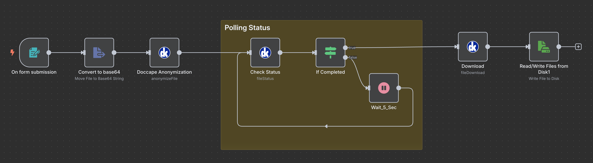

# n8n Workflow: Doccape File Anonymization

This example n8n workflow demonstrates how to anonymize a file using the [Doccape](https://api.doccape.de/) integration node.

## What It Does

- Accepts a file upload via a web form.
- Sends the file to Doccape for anonymization.
- Polls for completion status.
- Once completed, downloads the anonymized file.
- Saves the file to disk using the original file name.

## Requirements

- [n8n](https://n8n.io/) with custom doccape node is installed and running
- A valid **Doccape credential** with an API access key

> 🔐 To obtain an API key and learn more, visit [https://api.doccape.de/](https://api.doccape.de/)

## Workflow Preview

## How to Use

1. Import the workflow into your n8n instance.
2. Add a **Doccape credential** with your valid API access key.
3. Adjust the file path in the final node (`Read/Write Files from Disk1`) if needed.
4. Trigger the workflow by uploading a file through the form.

---

© scitlab
